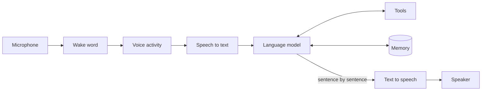

# Chilluevar

A voice assistant that runs entirely on your own machines. You say its name, it
listens, thinks, uses tools and answers out loud — and no audio, transcript or
reminder ever leaves the house.

Two things drive every design decision here:

- **Privacy.** Speech recognition, the language model and speech synthesis all
  run locally. The default configuration refuses to touch the network at all,
  and the logs do not record what was said unless you explicitly ask them to.
- **Latency.** A local assistant that takes five seconds to start answering is
  one nobody uses. Every stage is timed separately on every turn, and the
  benchmarks are published in this README as they improve.

> **Status: v0.0.** The contracts between modules, the event bus, the
> configuration and the test harness are in place. The pipeline itself is being
> built in the open — see the [issues](../../issues) and
> [milestones](../../milestones).

## How it works



Modules never call each other. Each one publishes events on an in-process bus
and subscribes to the ones it needs, which is what keeps speech recognition
ignorant of the language model and makes either replaceable in one line of
configuration. The contract lives in
[`events.py`](src/chilluevar/events.py) and
[`interfaces.py`](src/chilluevar/interfaces.py).

That design also buys us **satellite mode**: a small machine handles the
microphone, the wake word and playback, and sends the heavy work to a "brain" on
a stronger machine over the network. Switching between the two is a
configuration change, not a rewrite.

## Built with

| Stage | Engine |
| --- | --- |
| Wake word | [openWakeWord](https://github.com/dscripka/openWakeWord) |
| Voice activity | [Silero VAD](https://github.com/snakers4/silero-vad) |
| Speech to text | [faster-whisper](https://github.com/SYSTRAN/faster-whisper) |
| Language model | [Ollama](https://ollama.com) |
| Speech synthesis | [Piper](https://github.com/rhasspy/piper) |

## Try it

Requires Python 3.11 or newer.

```bash
git clone https://github.com/DDMalo/chilluevar.git
cd chilluevar
python -m venv .venv && source .venv/bin/activate
pip install -e ".[dev]"

cp config/chilluevar.example.yaml config/chilluevar.yaml
chilluevar --config config/chilluevar.yaml
```

The heavy dependencies are optional extras (`[audio]`, `[stt]`, `[tts]`,
`[wake]`), so the core installs in seconds and the test suite never downloads a
model. Install the extras as the matching features land.

```bash
pytest          # the whole suite, no models, no network
ruff check .    # lint
ruff format .   # format
```

## Layout

```
src/chilluevar/
├── events.py        # the messages modules exchange: the contract
├── interfaces.py    # protocols for every swappable engine
├── bus.py           # in-process publish/subscribe
├── config.py        # YAML configuration, overridable from the environment
├── logging_setup.py # logging that redacts transcripts by default
├── audio/           # capture, playback, wake word, voice activity
├── stt/             # speech-to-text engines
├── llm/             # language model clients
├── tts/             # speech synthesis engines
└── tools/           # what the model can actually do
docs/decisions/      # why each choice was made
```

## How we work

Built by two people, so the process is part of the project:

- `main` is protected; everything arrives through a reviewed pull request.
- One branch and one issue per subtask, labelled with its area and version.
- [Conventional Commits](https://www.conventionalcommits.org).
- CI runs `ruff` and `pytest` on every pull request, with fake engines — never a
  real model and never a network call.
- One milestone per version, a release and a CHANGELOG entry when it closes.
- Design decisions are written down in `docs/decisions/` as we take them.

## License

[MIT](LICENSE).
